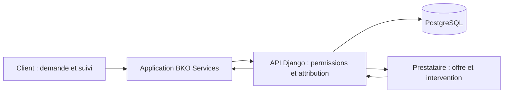

# Étape 0 — Cadrage et architecture de BKO Services

## 1. Périmètre

Lancement à Bamako. V1 : inscription, catégories, commune/quartier, création d'une demande, sélection d'un professionnel vérifié et disponible, notification, acceptation, suivi, confirmation et avis. Le mode urgent fait partie du parcours de demande. Les abonnements, paiements et fonctions avancées sont ajoutés dans les étapes prévues après validation du parcours principal.

**Décisions d'architecture :** dépôt `hamapixel/bko-services` ; monorepo comprenant un backend Django/DRF et **une seule** application Next.js/TypeScript avec des espaces séparés selon le rôle. PostgreSQL est la source de vérité. Redis et Celery sont prévus pour les tâches asynchrones, mais pas encore intégrés. Fuseau métier `Africa/Bamako` ; instants conservés en UTC en base. API versionnée sous `/api/v1/`. Identifiants publics UUID. Une seule ville initiale, mais villes, communes et quartiers restent administrables.

## 2. Schéma fonctionnel



1. Le client choisit une catégorie et un quartier, puis envoie sa demande au serveur.
2. Le serveur filtre les professionnels actifs, vérifiés, disponibles, compétents et présents dans la zone. Il crée des offres individuelles et déclenche des notifications.
3. Le professionnel voit **ses** offres uniquement. Jusqu'à l'attribution, l'offre masque le téléphone et l'adresse précise du client.
4. Le serveur attribue la demande à un seul professionnel dans une transaction et informe le client et les autres destinataires.
5. Le professionnel marque les étapes de l'intervention ; le client confirme la fin et peut laisser un seul avis.

## 3. Rôles et droits

| Rôle | Accès principal | Limite importante |
| --- | --- | --- |
| Visiteur | Pages publiques, catégories et profils publiables | Aucune demande privée |
| CLIENT | Ses demandes, échanges nécessaires, confirmation et avis | Ne voit jamais les autres clients |
| PROVIDER | Son profil, ses offres et ses interventions attribuées | Ne voit pas les offres et clients des autres professionnels |
| ADMIN | Gestion déléguée, vérifications, litiges et audit selon permissions | Opérations sensibles journalisées |
| SUPERADMIN | Administration de la plateforme et attribution des droits | Compte distinct, accès fortement protégé |

`User` personnalisé dès la première migration, rôles attribués uniquement côté serveur. Chaque endpoint filtre ses QuerySets et contrôle les droits de l'objet lors des actions. Une consultation par UUID étranger renvoie 403 ou 404 sans divulguer l'objet. Les tests IDOR couvrent clients et prestataires. L'interface Django Admin, distincte de `/admin` (interface métier), reste un outil technique restreint ; elle utilisera par exemple `/django-admin/`.

## 4. Backend et frontend

**Backend :** authentification et vérification téléphone ; validation des entrées et des images ; stockage privé des pièces d'identité ; modèles et transactions ; machine d'état et historique des demandes ; matching et acceptation atomique ; permissions et API ; notifications internes, push, SMS ; plans, paiements et audit ; OpenAPI, journaux et contrôles de santé.

**Frontend :** affichage des pages publiques et des trois espaces ; formulaires, navigation responsive, états chargement/erreur ; cache des ressources publiques utiles ; indication exacte de l'état des demandes hors connexion ; installation PWA et invitation de mise à jour. Le frontend n'attribue pas de rôles, ne confirme pas un paiement et ne déclare jamais une demande « envoyée » sans accusé du serveur.

**Sessions :** privilégier une session avec cookie `HttpOnly`, `Secure` et `SameSite`, protection CSRF, contrôle strict des origines et configuration adaptée aux domaines retenus. Aucun jeton sensible dans `localStorage`. Choix précis des domaines et du fournisseur SMS/push à confirmer avant leur intégration, sans changer les contrats métier.

## 5. Demandes et intégrité

Chemin normal : `CREATED → SEARCHING → OFFERED → ACCEPTED → EN_ROUTE → ARRIVED → IN_PROGRESS → PROVIDER_COMPLETED → CLIENT_CONFIRMED`. `CANCELLED` et `DISPUTED` sont accessibles uniquement par les transitions autorisées. `RequestStatusHistory` conserve l'acteur, l'ancien état, le nouvel état et la date ; aucune transition n'efface l'historique.

L'acceptation vérifie le professionnel destinataire, son éligibilité et la disponibilité de la demande. Dans une transaction PostgreSQL, verrouillage de la ligne de demande, réexamen de l'état, affectation unique et invalidation des offres concurrentes. Le test de concurrence emploiera PostgreSQL et deux transactions réelles : un seul gagnant. Les effets externes (push/SMS) sont programmés après commit afin de ne pas annoncer une attribution annulée.

Pour une demande urgente, cinq offres compatibles au maximum peuvent partir simultanément. En cas de perte de connexion, une demande saisie localement reste un brouillon **non envoyé** ; l'envoi et les actions sensibles exigent une réponse du serveur. Les images sont inspectées côté backend (type réel, dimensions, poids et quantité). Le coût final d'une réparation n'est jamais supposé connu automatiquement.

## 6. Arborescence cible

L'arborescence ci-dessous est **prévue**, pas créée à cette étape :

```text
bko-services/
├── README.md
├── .gitignore
├── .env.example                    # étape 2
├── docs/
│   └── architecture.md
├── backend/                         # étape 2
│   ├── manage.py
│   ├── config/                      # settings, urls, Celery
│   └── apps/
│       ├── core/                    # utilitaires, audit, health
│       ├── accounts/                # User, sessions, OTP
│       ├── locations/               # villes, communes, quartiers
│       ├── catalog/                 # catégories de services
│       ├── providers/               # profils, zones, vérification
│       ├── requests/                # demandes, offres, transitions
│       ├── reviews/                 # avis
│       ├── complaints/              # signalements
│       ├── notifications/           # centre interne et Web Push
│       ├── messaging/               # SMS, fournisseur, journal
│       ├── subscriptions/           # plans et abonnements
│       └── payments/                # paiement et fournisseurs
├── frontend/                        # étape 2 : Next.js + TypeScript
│   ├── app/                         # public, client, provider, admin
│   ├── components/
│   └── public/                       # icônes et manifest plus tard
└── .github/workflows/               # étape 24
```

Les applications sont créées au fur et à mesure des étapes. Des services métier dans les applications Django portent le matching, les transitions, les notifications, les SMS et les paiements ; les vues restent minces. Les tables financières importantes sont conservées et désactivées/archivées si besoin.

## 7. Feuille de route condensée

| Étapes | Livraison vérifiable |
| --- | --- |
| 0 | Cadrage, architecture, README et `.gitignore` |
| 1–4 | Environnement, squelette, Custom User avant migrations métier, inscription et connexion |
| 5–7 | Bamako, catégories administrables et prestataires vérifiés |
| 8–11 | Demandes, matching, attribution atomique, permissions IDOR et workflow |
| 12–16 | Avis, centre de notifications, push, SMS/OTP, plaintes |
| 17–19 | Abonnements, paiements puis PWA complète et hors connexion |
| 20–22 | Espaces client, prestataire et administration responsive |
| 23–25 | Tests, CI GitHub Actions et Docker |
| 26–27 | Préproduction multi-appareils, corrections, production et restauration testée |

Les critères de passage et le schéma d'hébergement actuel figurent dans [production-roadmap.md](production-roadmap.md).

L'authentification de l'étape 4 inclura la logique OTP et un transport de développement sûr ; l'envoi SMS professionnel, son journal et ses limites seront finalisés à l'étape 15. Le push de l'étape 14 nécessitera un service worker minimal ; l'étape 19 complétera l'installation, le cache et la gestion hors connexion. Ces dépendances seront testées à l'étape où elles apparaissent.

## 8. Git et critères de passage

Nom de dépôt retenu : [`hamapixel/bko-services`](https://github.com/hamapixel/bko-services). Branche stable `main` ; branche `develop` et branches `feature/*` ou `fix/*` au moment de commencer les modifications correspondantes. Un commit par grande étape après tests et `git status`. Aucune clé ni donnée personnelle dans les commits ; le fichier `.env.example` sera ajouté avec des valeurs vides à l'étape 2.

Avant production : inscription et OTP ; vérification prestataire ; demande normale et urgente ; attribution unique et refus d'accès IDOR ; suivi et avis ; notifications et SMS ; plaintes et abonnement ; responsive et installation Android/iPhone ; état hors connexion et reconnexion ; HTTPS ; sauvegarde et **restauration réellement vérifiée**. Le scénario complet client → professionnel → confirmation → avis sera automatisé.
